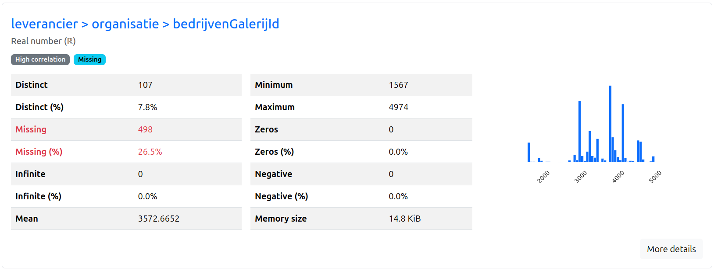
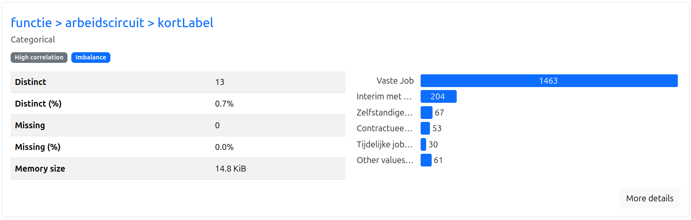
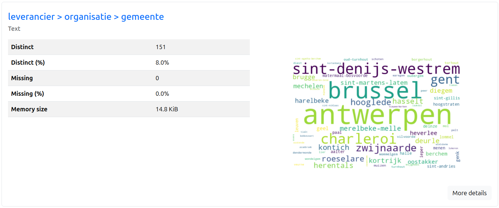
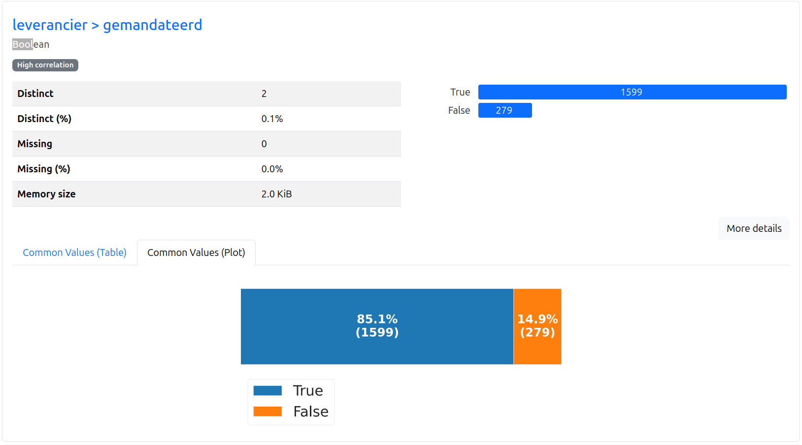
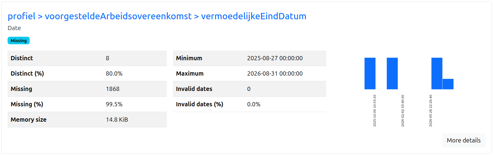

# 📊 Data Describer

   


## 📖 Description

**Data Describer** is a fast and efficient tool for exploring JSON data to create LLM-friendly data descriptions. Instead of manually analyzing complex JSON structures, this tool automates the entire process:

1. **Flatten** - JSON files are flattened using pandas `json_normalize` with a `>` separator to handle nested structures
2. **Analyze** - Uses [ydata-profiling](https://github.com/ydataai/ydata-profiling) to generate comprehensive HTML and JSON reports with statistical analysis
3. **Clean** - Extracts only relevant statistical measures (n_distinct, type, min, max, mean, std, value_counts, etc.)
4. **Shrink** - Reduces data size by intelligently limiting value counts while preserving the most important information
5. **Enrich** - Leverages LLMs (Claude 3.5 Sonnet via OpenRouter) to generate human-readable descriptions for the entire dataset and each field

The end result is a compact, enriched JSON file that contains both statistical data and natural language descriptions - perfect for pasting into LLM contexts when you need AI assistance with data-related questions.

**Built as a single-file script** (`explore-data.py`) for easy copy-pasting into your projects. It works on directories containing multiple JSON files with the same structure, making it ideal for batch data analysis.

---

## 🖼️ Preview

Get a sneak peek at how you can explore your data with rich visualizations and insights:

### 📈 Numerical Data


### 📝 Categorical Data


### 📄 Text Data


### ✅ Boolean Data


### 📅 Date/Time Data


> **Note:** These are just a few examples! The [ydata-profiling](https://github.com/ydataai/ydata-profiling) library generates many more views, interactive charts, correlation matrices, missing data analysis, and much more. Click through the generated HTML report to explore all features!

---

## ✨ Features

- 🚀 **Fast Data Exploration** - Analyze directories with multiple JSON files in seconds
- 📦 **Single File Script** - Easy to copy and integrate into any project
- 🤖 **LLM-Friendly Output** - Generate compact, enriched descriptions perfect for AI assistants
- 📊 **Comprehensive Analysis** - Powered by ydata-profiling for deep statistical insights
- 🎯 **Smart Data Reduction** - Intelligently shrinks data while preserving key information
- 💬 **Natural Language Descriptions** - AI-generated explanations for datasets and individual fields
- 🔄 **Batch Processing** - Handle multiple JSON files with the same structure
- 🎨 **Beautiful HTML Reports** - Interactive visualizations and charts
- 💾 **Caching Support** - SQLite caching for LLM calls to save time and API costs
- 🎛️ **Flexible CLI** - Run individual steps or the entire pipeline

---

## 📁 Project Structure

```
data-describer/
│
├── explore-data.py          # Main script - all functionality in one file
├── requirements.txt         # Python dependencies
├── .env                     # Environment variables (API keys, not in repo)
├── .gitignore              # Git ignore rules
│
├── assets/                  # Screenshots for documentation
│   ├── boolean.png
│   ├── categorical.png
│   ├── datum.png
│   ├── numbers.png
│   └── text.png
│
├── jobs/                    # Example: input data directory
│   └── bronze/vdab/
│       └── job_listings/    # JSON files to analyze
│
└── report/                  # Generated output files
    ├── {name}_raw.html      # Interactive HTML report
    ├── {name}_raw.json      # Full profiling data
    ├── {name}_cleaned.json  # Cleaned statistics
    ├── {name}_shrinked.json # Reduced data
    └── {name}_enriched.json # Final output with AI descriptions
```

---

## 🚀 Getting Up and Running

### Prerequisites

- Python 3.8+
- pip
- OpenRouter API key (for LLM enrichment step)

### Installation

1. **Clone or copy the script**
   ```bash
   # If you have the repo
   cd data-describer
   
   # Or just copy explore-data.py to your project
   ```

2. **Install dependencies**
   ```bash
   pip install -r requirements.txt
   ```

3. **Set up environment variables**
   
   Create a `.env` file in the project root:
   ```env
   OPENROUTER_API_KEY=your_api_key_here
   OPENROUTER_BASE_URL=https://openrouter.ai/api/v1
   YOUR_SITE_URL=https://github.com/yourusername/yourproject
   YOUR_SITE_NAME=Your Project Name
   ```
   
   > Get your OpenRouter API key at [openrouter.ai](https://openrouter.ai/)

---

## 💻 How to Use

### Basic Usage - Analyze Only

Generate HTML and JSON reports without LLM enrichment:

```bash
python explore-data.py /path/to/json/directory
```

This creates:
- `report/report_raw.html` - Interactive visualization
- `report/report_raw.json` - Complete profiling data

### Run All Steps (Recommended)

Process data through the entire pipeline - analyze, clean, shrink, and enrich:

```bash
python explore-data.py /path/to/json/directory --all
```

### Custom Output Names

Use custom names for your reports:

```bash
python explore-data.py /path/to/json/directory --all --name my_analysis
```

### Run Individual Steps

```bash
# Step 1: Analyze (default)
python explore-data.py /path/to/json/directory

# Step 2: Clean
python explore-data.py /path/to/json/directory --clean --name report

# Step 3: Shrink
python explore-data.py /path/to/json/directory --shrink --name report

# Step 4: Enrich with LLM descriptions
python explore-data.py /path/to/json/directory --enrich --name report
```

### Command Line Options

```
positional arguments:
  directory             Directory containing JSON files

optional arguments:
  -h, --help            Show help message
  -a, --all             Run all steps (analyze, clean, shrink, enrich)
  -c, --clean           Run cleaning step only
  -s, --shrink          Run shrink step only
  -e, --enrich          Run enrich step only
  -n, --name NAME       Base name for output files (default: report)
```

### Example Workflow

```bash
# Analyze job listings data
python explore-data.py ./jobs/bronze/vdab/job_listings/ --all --name job_analysis

# Results will be in:
# - report/job_analysis_raw.html (open in browser)
# - report/job_analysis_enriched.json (paste into LLM context)
```

---

## ⏱️ Development Timeline

This project was created in approximately **4 hours** using vibe coding - letting the ideas flow and building iteratively with rapid prototyping. The result is a practical tool that solves a real problem: making data understandable for both humans and AI.

---

## 🙏 Credits

Built with the assistance of **Cursor IDE** - an AI-powered code editor that made vibe coding a breeze. The combination of AI assistance and rapid iteration enabled quick experimentation and feature development.

Special thanks to:
- [ydata-profiling](https://github.com/ydataai/ydata-profiling) for the amazing profiling capabilities
- [LangChain](https://www.langchain.com/) for LLM integration
- [OpenRouter](https://openrouter.ai/) for easy access to Claude and other models
- [Anthropic Claude](https://www.anthropic.com/) for generating insightful data descriptions

---

## 📝 License

Feel free to use and modify this script for your projects!

---

## 🤝 Contributing

This is a simple single-file utility script. Feel free to fork it, modify it, and adapt it to your needs. If you create something cool with it, share it with the community!

---

Made with ❤️ and ☕ using vibe coding

